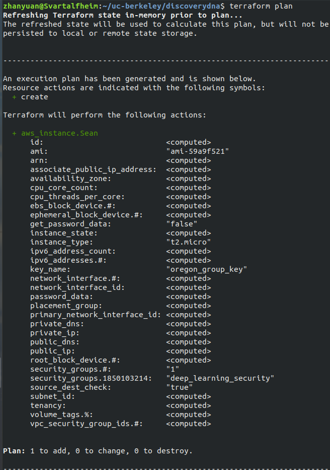

# Provision an EC2 via terraform
This is a tiny terraform tutorial to show how to utilize the basic functions of terraform to provision an EC2.
More contents may be added in the future.
## 0. What's terraform

An awesome tool that allows us to start an instance efficiently through code and command line.  
Let's get started!

## 1. Install terraform
Follow this [link](http://www.terraform.io/intro/getting-started/install.html) to install terraform
and add it to your PATH.

*Note for adding terraform to PATH*:
1. Extracting the .zip file you downloaded will give you a binary file.
2. To add terraform to PATH, simply move the terraform binary file to any of your bin folder (e.g. /usr/bin)
will do the trick. If this doesn't work, check [this tutorial](https://github.com/ravsau/aws-labs/blob/master/terraform-aws/terraform-ec2.MD).
    
## 2. Configuration

1. Go to your key directory, **which contains the .pem file**.
2. Paste the following code to a .tf file (e.g. ec2.tf):
```commandline
provider "aws" {
  access_key = "YOUR-ACCESS-KEY"
  secret_key = "YOUR-SECURITY-KEY"
  region     = "us-west-2"
}

resource "aws_instance" "myInstance" {
  ami = "ami-59a9f521"
  instance_type = "t2.micro"
  security_groups = ["deep_learning_security"]
  key_name = "oregon_group_key"
}
```
*Note*: 
- Replace `YOUR-ACCESS-KEY` and `YOUR-SECURITY-KEY` with your own access key id and secret access key, which are in the `credentials.csv` sent by Ciera.
- Remember to change the `instance_type` (e.g. `t2.nano`, `t2.xlarge`, or `p2.xlarge`) if necessary.
- You can change `myInstance` to anything you like.

### Explanation:
The configuration code above is in accordance with the setting in `aws_notes.md`. There shows the one-to-one correspondence in case you're curious:
- region: `us-west-2` is the code of US West (Oregon). (check [here](https://docs.aws.amazon.com/AWSEC2/latest/UserGuide/using-regions-availability-zones.html))
- ami: `ami-59a9f521` is the AMI ID of deep_learning_AWS_ubuntuV9_18July2018
- instance_type: it's the same as the instance type you want to create.
- security_groups: ["deep_learning_security"] corresponds to the security group we use.
- key_name: `oregon_group_key` corresponds to the `oregon_group_key.pem` file.

## 3. To Use
- Inside the folder containing the .tf file, run 
```commandline
terraform init
```

- To check the setting of the instance that you are about to request, run
```commandline
terraform plan
```
There's the example output:


- To provision the ec2, run:
```commandline
terraform apply
```
 You can log in to EC2 management Console to check if the instance successfully starts.
 
 - To terminate the instance, run:
 ```commandline
terraform destroy
```

That's pretty much it!  
If you encounter some problems and manage to solve them, feel free to add the solutions to this tutorial.
