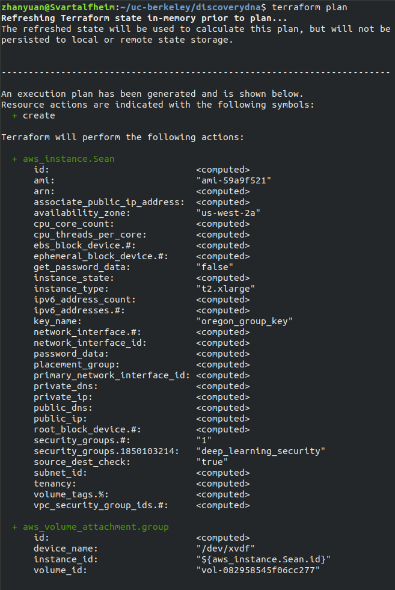

# Provision an EC2 via Terraform
This is a tiny Terraform tutorial to show how to utilize the basic functions of terraform to provision an EC2.  
--**Note:**-- The following setup of Terraform automates the process of creating an EC2 instance and sets the "Group Volume" volume as a default volume attachment.  
In order to change the type of instance, users need to modify the .tf file. See more details below.  
More contents may be added in the future.  

## 0. What's terraform

An awesome tool that allows us to start an instance efficiently through codes and command lines.  

## 1. Install terraform
Follow this [link](http://www.terraform.io/intro/getting-started/install.html) to install terraform
and add it to your PATH.

*Note for adding terraform to PATH*:
1. Extracting the .zip file you downloaded will give you a binary file.
2. To add terraform to PATH, simply moving the terraform binary file to any of your bin folder (e.g. /usr/bin)
will do the trick. If this doesn't work, check [this tutorial](https://github.com/ravsau/aws-labs/blob/master/terraform-aws/terraform-ec2.MD).
    
## 2. Configuration

1. Go to your key directory, **which contains the .pem file**.
2. Create a file called "terraform.tfvars", or any other .tfvars file. Then, copy and paste
the following codes into it:
```commandline
access_key = [YOUR-ACCESSKEY-HERE]
secret_key = [YOUR-SECRETKEY-HERE]
```
*Note*:
- Replace [YOUR-ACCESSKEY-HERE] and [YOUR-SECRETKEY-HERE] with your own access key id and secret access key, which are in the `credentials.csv` sent by Ciera.

3. Create another file called ec2.tf, or any other .tf file you like, in the same directory. Then, copy and paste the following code into it:  

```commandline
variable "access_key" {}
variable "secret_key" {}
variable "amis" {
  type = "map"
  default = {
    "us-west-2" = "ami-59a9f521"
  }
}
variable "region" {
  default = "us-west-2"
}

provider "aws" {
  access_key = "${var.access_key}"
  secret_key = "${var.secret_key}"
  region = "${var.region}"
}

resource "aws_volume_attachment" "group" {
  device_name = "/dev/xvdf"
  volume_id   = "vol-082958545f06cc277"
  instance_id = "${aws_instance.Sean.id}"
}

resource "aws_instance" "myInstance" {
  ami = "${lookup(var.amis, var.region)}"
  instance_type = "t2.xlarge"
  //              "t2.micro" for data-unrelated tasks
  //              "t2.xlarge" for GPU-unrelated
  //              "p2.xlarge" for GPU-related
  security_groups = ["deep_learning_security"]
  key_name = "oregon_group_key"
  availability_zone = "us-west-2a"
}
```
*Note*:  

- Remember to change the `instance_type` (e.g. `t2.nano`, `t2.xlarge`, or `p2.xlarge`) if necessary.  

- You can change `myInstance` to anything you like. It's just a name for Terraform's reference.

### Explanation:
The configuration code above is in accordance with the setting in `aws_notes.md`. There shows the one-to-one correspondence, in case you're curious:  

- region: `us-west-2` is the code of US West (Oregon). (check [here](https://docs.aws.amazon.com/AWSEC2/latest/UserGuide/using-regions-availability-zones.html))  

- ami: `ami-59a9f521` is the AMI ID of deep_learning_AWS_ubuntuV9_18July2018  

- instance_type: it's the same as the instance type you want to create.  

- security_groups: ["deep_learning_security"] corresponds to the security group we use.  

- key_name: `oregon_group_key` corresponds to the `oregon_group_key.pem` file.

## 3. To Use
Go to the folder containing the .tf  and corresponding .tfvars files:

- If this is the first time of using Terraform, run 
```commandline
terraform init
```

- To check the setting of the instance that you are about to request, run
```commandline
terraform plan
```
Here's an example output:  


- To provision the ec2, run:
```commandline
terraform apply
```
 You can log in to EC2 management Console to check if the instance successfully starts.
 
 - To terminate the instance, run:
 ```commandline
terraform destroy
```

That's pretty much it!  
If you encounter some problems and manage to solve them, feel free to add the solutions to this tutorial.
